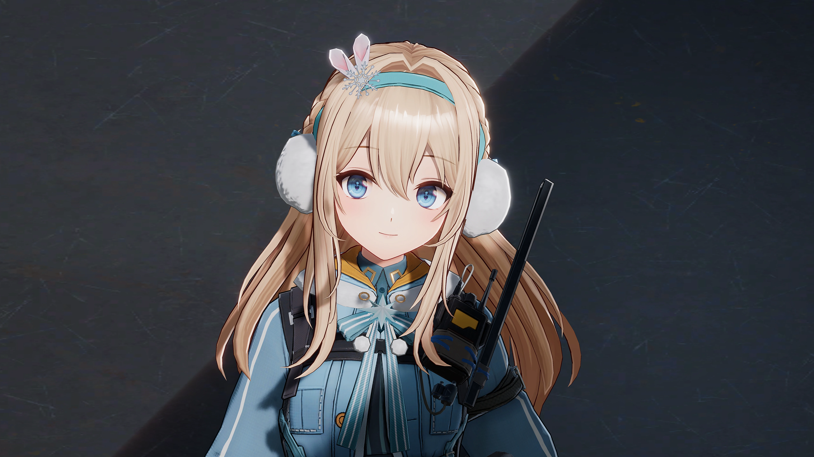

# **Danbaidong Render Pipeline**

## Announcement

Just add something I need.

`DanbaidongRP` is a custom render pipeline built based on Universal RP 17.0.3, Unity 6 (6000.0.0f1). This pipeline is optimized for both PBR and NPR Toon Rendering, offering enhanced flexibility for various rendering needs. Future updates will include additional features tailored to my specific requirements.

Subscribe:

* https://space.bilibili.com/39694821
* https://www.zhihu.com/people/danbaidong1111

Roadmap & Features:

- [X]  PBR Toon Shader
- [ ]  Cel shading
- [X]  Danbaidong Shader GUI
- [X]  PerObjectShadow
- [X]  PCSS/PCF Soft Shadows
- [X]  Shadow Scattering
- [ ]  Ray Tracing Shadow
- [ ]  Transparent Shadows
- [X]  Toon Toonmapping
- [X]  Toon Bloom
- [X]  Visual Sky
- [X]  High Quality SSR (Ray Tracing)
- [ ]  High Quality SSAO
- [ ]  High Quality SSGI
- [X]  Cluster Deferred lighting
- [X]  Character Forward lighting
- [ ]  Atmosphere Fog
- [ ]  Idol Live アイドル!!!!!

# Usage

* Create a new Unity 6 URP project (6000.0.0f1).
* *Window -> Package Manager*, remove *Universal RP* and delete the contents of the *Assets/Settings* folder.
* Add *DanbaidongRP* through the *Package Manager*. It is recommended to use the "Install package from disk..." option to individually add the [Core](https://github.com/danbaidong1111/DanbaidongRPCore), [Config](https://github.com/danbaidong1111/DanbaidongRPConfig), and [DanbaidongRP](https://github.com/danbaidong1111/DanbaidongRP) packages (select the `package.json` file for each).
* In the *Settings* directory, recreate the DanbaidongRP Asset by right-clicking and selecting *Create -> Rendering -> Danbaidong RP Asset and Renderer*. Then, in *Edit -> Project Settings -> Graphics*, set the *Default Renderer Pipeline* to the pipeline Asset you just created. The scene should now render correctly.
* Next, restart the project. A Wizard window will pop up, which contains the necessary configurations for the pipeline to use correctly.

# Documents

[DanbaidongRP Documents](https://miusjun13qu.feishu.cn/docx/EXPtdrNmnox8hkx4mnCcy8QNn2b?from=from_copylink) (CN)

# Character Rendering

# Danbaidong Shader GUI

CustomEditor "UnityEditor.DanbaidongGUI.DanbaidongGUI"`

# Shadows

**Shadow Scattering**

**Per Object Shadow**

# Reflections (RayTracing)

# GPU Lights (Cluster)

